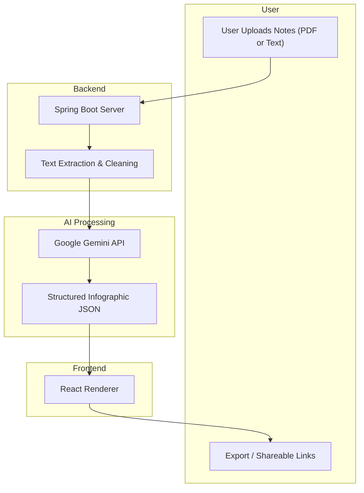

# 📘 NoteFlow  
**An AI-Powered Platform for Automated Infographic Generation**  

---

## 🚀 Project Overview
**NoteFlow** is a full-stack web application designed to simplify the way students and teachers interact with educational content.  
The platform leverages **AI (Google Gemini API)** to automatically transform raw, unstructured notes (PDFs, text, or topic queries) into **structured, visually appealing, and shareable infographics**.  

This helps:
- 🎓 **Students** → Convert messy notes into engaging study guides.  
- 👨‍🏫 **Teachers** → Deliver content in a more attractive and effective way.
  
---

## 🎯 Problem Statement
Students often accumulate large volumes of disorganized notes from lectures and textbooks in various formats.  
Manually organizing these notes into a coherent, visually appealing format is:  
- ⏳ Time-consuming  
- 😵 Inefficient  
- 📉 Reduces productivity and collaboration  

Current digital note-taking platforms lack the **intelligent automation** needed to turn raw notes into engaging learning material.  

---
## 🧩 Objectives
1. Integrate **Google Gemini API** as the core engine to interpret and enhance educational content.  
2. Engineer a workflow that includes prompt design, data transmission, and structured infographic generation.  
3. Build a secure, scalable, and intuitive **full-stack web platform** with:  
   - **Frontend:** React + Tailwind  
   - **Backend:** Java (Spring Boot)  
   - **Database:** MongoDB  
4. Provide features like:  
   - User profiles & note management  
   - Export infographics as PDF/PNG  
   - Anonymous, shareable infographic links  

---

## 🏗️ System Architecture

## 👥 Team Members

- Harsh Verma [4th year, CSE]
- Gaurav Vashistha [4th year, CSE]
- Gunjan Jangid [4th year, CSE]
- Chirag Murdiya [4th year, CSE]

**Mentor:** Dr. Atul Chaudhary  

---

## 📜 License

This project is developed as part of the Final Year Project (B.Tech – Computer Science & Engineering, 4th Year-7th Semester) under the guidance of **Dr. Atul Chaudhary**.  
All rights reserved © 2025, **NoteFlow**.
