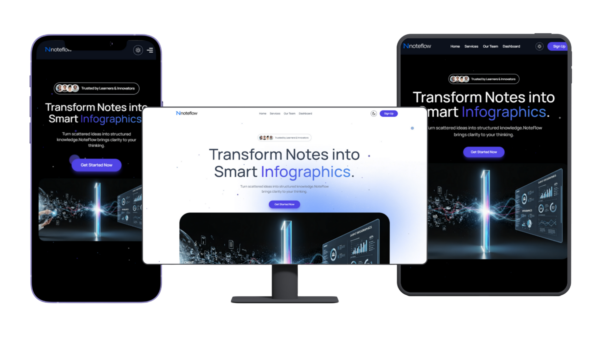
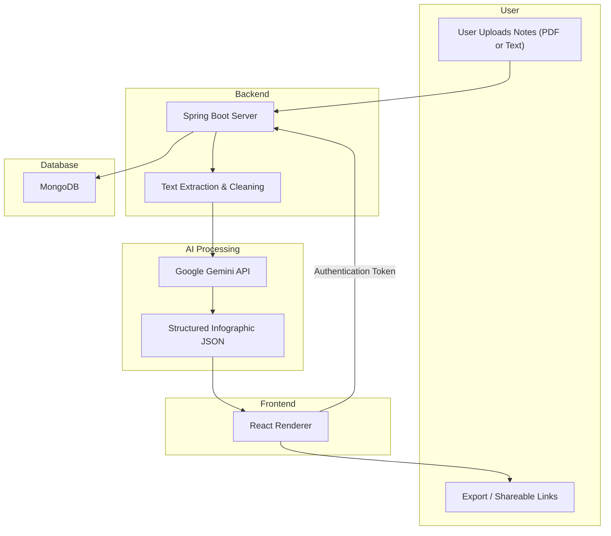

# 📘 NoteFlow  
**An AI-Powered Platform for Automated Infographic Generation** ---

## 🚀 Project Overview
**NoteFlow** is a full-stack web application designed to simplify the way students and teachers interact with educational content.  
The platform leverages **AI (Google Gemini API)** to automatically transform raw, unstructured notes (PDFs, text, or topic queries) into **structured, visually appealing, and shareable infographics**.  

This helps:
- 🎓 **Students** → Convert messy notes into engaging study guides.  
- 👨‍🏫 **Teachers** → Deliver content in a more attractive and effective way.
  
---

## 🎯 Problem Statement
Students often accumulate large volumes of disorganized notes from lectures and textbooks in various formats.  
Manually organizing these notes into a coherent, visually appealing format is:  
- ⏳ Time-consuming  
- 😵 Inefficient  
- 📉 Reduces productivity and collaboration  

Current digital note-taking platforms lack the **intelligent automation** needed to turn raw notes into engaging learning material.  

---

## 🧩 Objectives
1. Integrate **Google Gemini API** as the core engine to interpret and enhance educational content.  
2. Engineer a workflow that includes prompt design, data transmission, and structured infographic generation.  
3. Build a secure, scalable, and intuitive **full-stack web platform** with:  
   - **Frontend:** React + Tailwind  
   - **Backend:** Java (Spring Boot)  
   - **Database:** MongoDB  
4. Provide features like:  
   - User profiles & note management  
   - Export infographics as PDF/PNG  
   - Anonymous, shareable infographic links  

---

<div align="center" style="border: 2px solid #eaeaea; border-radius: 12px; padding: 10px; background-color: #f9f9f9;">
  
  <p><em>First Look of NoteFlow</em></p>
</div>

---

## ✨ Frontend Implementation Status (React/Tailwind)

The core user interface and interaction flow are now fully complete, utilizing **React Router** for navigation, **Clerk** for user management, and **Tailwind CSS** for styling.

### 🏠 Landing Page (Home)
- Fully designed with hero section, service sections, and team section.
- Implemented **Theme Toggling** (Light/Dark mode).
- **Authentication Flow:** "Get Started Now" and "Sign Up" buttons trigger the **Clerk Sign-In modal** if the user is not authenticated.

### 💡 Infographic Generator Page (`/generate`)
- **Secure Access:** Only authenticated (signed-in) users can access this page. Unauthenticated users are redirected.
- **Modern UI Layout:** Implemented a responsive, full-screen layout inspired by **Google Gemini/ChatGPT**.
- **Sidebar (Chat History):**
    - **Desktop:** Sidebar defaults to **Open** (`280px`). When collapsed, it transitions to a **Mini-Sidebar** (`64px`) containing only the menu and New Chat icon, ensuring the main content shifts correctly.
    - **Mobile:** Sidebar defaults to **Closed** and slides out on demand, providing full screen space for the main content.
- **Input Area:** Implemented a persistent, centrally located input bar for text prompts and a file upload button (for multimodal input).
- **User Management:** The **Clerk User Button** is integrated into the sidebar footer for easy access to sign-out and account management.

---

## 🏗️ System Architecture


## 👥 Team Members

- Harsh Verma [4th year, CSE]
- Gaurav Vashistha [4th year, CSE]
- Gunjan Jangid [4th year, CSE]
- Chirag Murdiya [4th year, CSE]

**Mentor:** Dr. Atul Chaudhary  

---

## 🚀 Getting Started

### 1. Clone the Repository
```bash
git clone https://github.com/CodeWith-Gaurav/NoteFlow
cd NoteFlow
```
## Install Dependencies
```bash
npm install
# or
yarn install
```
## Run the Application
```bash
npm run dev
# or
yarn dev
```
The application will now run on http://localhost:5173
 (or your configured port) with the enhanced preloader and entrance sequence.
 
## 📜 License

This project is developed as part of the Final Year Project (B.Tech – Computer Science & Engineering, 4th Year-7th Semester) under the guidance of **Dr. Atul Chaudhary**.  
All rights reserved © 2025, **NoteFlow**.
